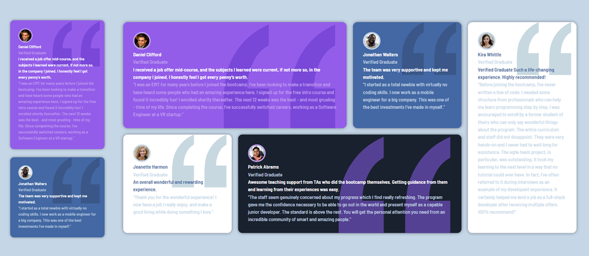

# Frontend Mentor - Testimonials grid section solution

This is a solution to the [Testimonials grid section challenge on Frontend Mentor](https://www.frontendmentor.io/challenges/testimonials-grid-section-Nnw6J7Un7). Frontend Mentor challenges help you improve your coding skills by building realistic projects.

## Table of contents

- [Overview](#overview)
  - [Screenshot](#screenshot)
  - [Links](#links)
- [My process](#my-process)
  - [Built with](#built-with)
  - [What I learned](#what-i-learned)
  - [Continued development](#continued-development)
  - [Useful resources](#useful-resources)
- [Author](#author)
- [Acknowledgments](#acknowledgments)

**Note: Delete this note and update the table of contents based on what sections you keep.**

## Overview

### Screenshot



### Links

- Solution URL: (https://github.com/Junbol-Frontend-Mentor/testimonials-grid)
- Live Site URL: (https://junbol-frontend-mentor.github.io/testimonials-grid/)

## My process

### Built with

- Semantic HTML5 markup
- CSS custom properties
- Sass(SCSS)
- Flexbox
- Mobile-first workflow
- GIT/GitHub
- PowerShell Comandline

### What I learned

Working with SCSS Grid & MediaQueries

```

@media (min-width: 768px) {
  .container {
    display: grid;
    grid-template-columns: repeat(4, 1fr); // Creates 4 equal columns
    grid-gap: 20px; // Adjusting the gap between grid items
    align-items: start; // Aligns items to the start of their cell
    grid-auto-rows: minmax(250px, auto); // Ensures that rows are at least 250px tall
    grid-gap: 20px; // Maintains a fixed gap
    width: 80%;
    padding: 20px;
    margin-top: 30px;
    align-items: stretch; // Stretches items to fill the grid row height
  }
  .card {
    min-height: 300px; // Sets a minimum height and allows expansion based on content
    margin: 0rem;
  }
  // Card 1 (Daniel) takes the first row and spans two columns
  .card:nth-child(1) {
    grid-column: 1 / span 2;
    grid-row: 1;
  }

  // Card 2 (Jonathan) is placed in the first row, third column
  .card:nth-child(2) {
    grid-column: 3;
    grid-row: 1;
  }

  // Card 3 (Jeanette) takes the second row, first column
  .card:nth-child(3) {
    grid-column: 1;
    grid-row: 2;
  }

  // Card 4 (Patrick) starts at the second column and spans two columns in the second row
  .card:nth-child(4) {
    grid-column: 2 / span 2;
    grid-row: 2;
  }

  // Card 5 (Kira) occupies the entire fourth column, and should align with Card 2's top
  .card:nth-child(5) {
    grid-column: 4;
    grid-row: 1 / span 2;
  }
}
```

### Continued development

I would like to continue studying responsive SCSS specially with Grid + Flexbox and CSS animation, transitions and FX like parallax.

### Useful resources

- [web.dev](https://web.dev/learn/css) - This helped me for get back on track with CSS.
- [w3schools](https://www.w3schools.com/css/default.asp) - The one place to refresh stuff in practical way.

## Author

- Website - [Junier Bolivar](https://www.bolivarcreativedesign.com)
- Frontend Mentor - [Junbol](https://www.frontendmentor.io/profile/Junbol)
- Twitter - [@JunierBolivar](https://www.twitter.com/@JunierBolivar)

## Acknowledgments
